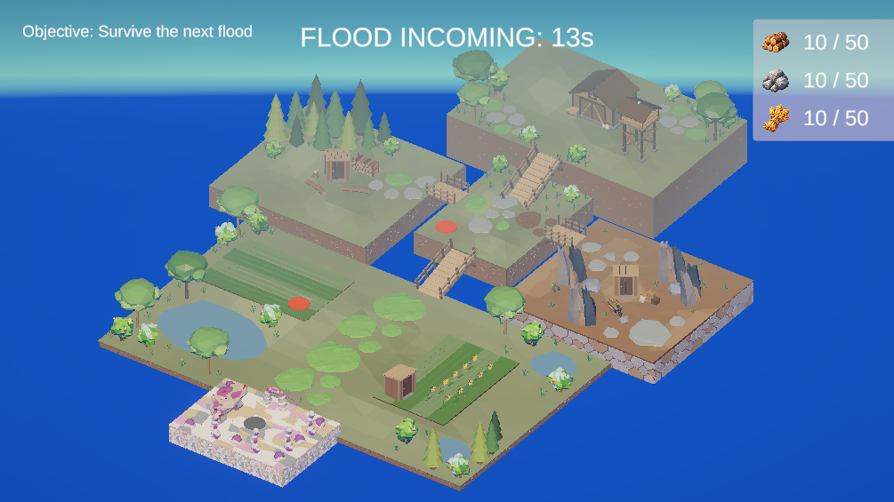
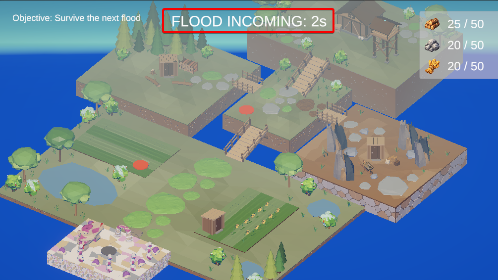
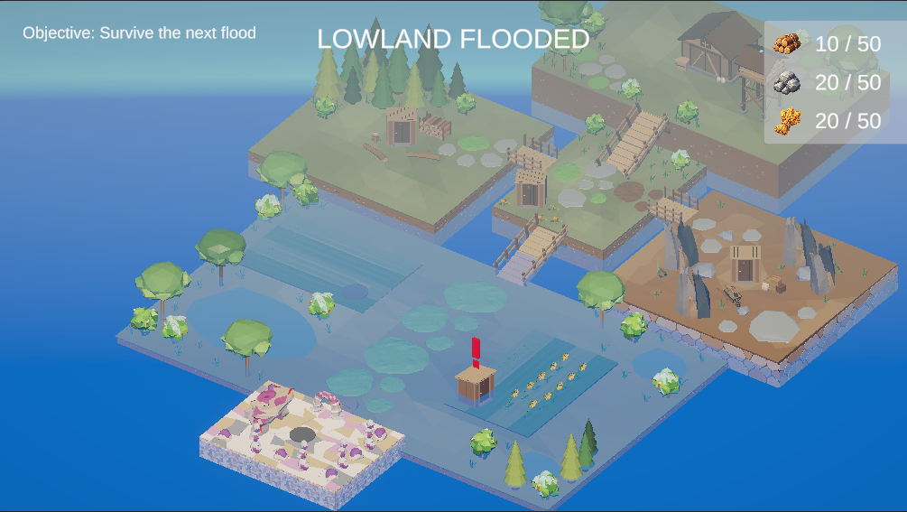
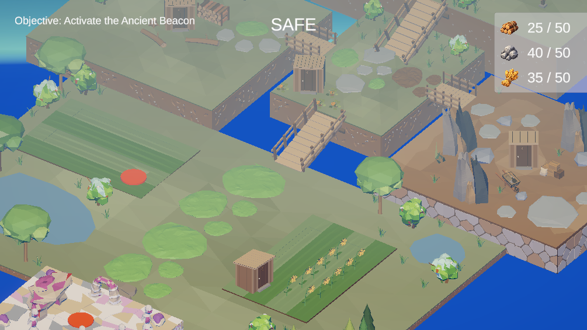
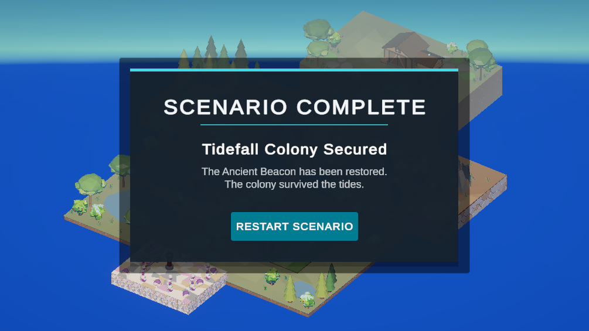

# Tidefall Colony

A compact Unity city-builder / level design prototype built around a simple spatial risk-reward mechanic:

> **Low ground provides better productivity, but is periodically flooded. High ground is safer, but less efficient.**

The project was designed as a short 5-minute playable scenario focused on **level design, gameplay readability, progression, environmental risk and simple systemic interactions**.



## Project Goals

Tidefall Colony was created as a focused portfolio project demonstrating:

- Level and spatial design in Unity
- Risk/reward design based on terrain elevation
- Objective-driven scenario progression
- Simple resource economy and production systems
- Environmental hazards affecting gameplay
- Visual Scripting used for level-state logic
- C# gameplay systems and UI
- Iteration from greybox to a playable polished prototype

The scope was intentionally kept small so the project could focus on clear design decisions rather than content volume.

## Core Gameplay Loop

The player develops a small settlement while preparing for recurring floods.

The scenario progression is:

**Build Lumber Camp → Expand storage → Build Flood Watchtower → Build Quarry → Survive Flood → Repair Crossing → Establish Food Production → Survive Second Flood → Activate Ancient Beacon**

Resources are:

- **Wood** — construction and early progression
- **Stone** — infrastructure and crossing repair
- **Food** — final settlement objective

The initial storage capacity is limited to **20 resources**. Building a Warehouse increases the capacity to **50**, making infrastructure expansion part of the progression rather than a passive upgrade.

## Flood System

Flooding is the central environmental mechanic.

The scenario cycles through:

**SAFE → FLOOD WARNING → FLOODED → WATER RECEDING**



The Flood Watchtower provides additional warning time before the flood begins, turning information and preparation time into a gameplay resource.

During a flood, the lower part of the map becomes submerged while elevated areas remain safe.



The flood cycle and level-state transitions are implemented using **Unity Visual Scripting**.

## Spatial Risk / Reward

The map is divided vertically into safe and dangerous terrain.

Players eventually choose between two approaches to food production:

**High Ground Farm**
- Lower production rate
- Safe from flooding
- No repair costs

**Lowland Farm**
- Higher production rate
- Located in the flood zone
- Becomes damaged during floods
- Must be repaired for 50% of its original construction cost

This creates a simple but visible trade-off between **efficiency and resilience**.



The Broken Crossing also acts as a progression gate. Repairing it opens access to the food-production stage of the scenario and visually connects previously separated gameplay areas.

## Building Interaction & Feedback

Building plots communicate their current state through materials and contextual UI.

Plots can be:

**Locked → Available → Built → Damaged**

Hovering over a plot displays:

- Building name
- Construction or repair cost
- Availability state
- Resource requirements

Damaged Lowland Farms expose the repair system directly through the same interaction.


## Scenario Completion

The final objective is to restore the Ancient Beacon after establishing a functioning settlement and surviving the required flood cycles.



The complete scenario takes approximately **5 minutes** during a normal playthrough.

## Technical Implementation

**Engine:** Unity 6  
**Render Pipeline:** Universal Render Pipeline (URP)  
**Programming:** C#  
**Level Logic:** Unity Visual Scripting  
**Input:** Unity Input System  
**UI:** TextMeshPro  

Key systems include:

- Objective progression system
- Resource production and spending
- Dynamic resource storage capacity
- Building plot locking and unlocking
- Contextual building tooltips
- Flood state machine
- Flood warning extension from Watchtower
- Flood-sensitive building production
- Building damage and repair
- Scenario completion and restart
- RTS-style camera movement and zoom

## Level Design Process

The level was first created as a functional greybox focused on:

- clear elevation differences,
- readable routes between gameplay zones,
- landmark placement,
- progression gating,
- flood-safe and flood-risk areas,
- sightlines and visual guidance.

The final environment art pass preserved the original greybox layout and gameplay collision while replacing or decorating the level with stylized low-poly assets.

This allowed the visual presentation to improve without changing the tested spatial structure of the level.

## Controls

| Input | Action |
|---|---|
| **WASD** | Move camera |
| **Mouse Wheel** | Zoom |
| **Mouse Hover** | Inspect building plot |
| **Left Mouse Button** | Build / repair |

## Art

The environment uses selected free low-poly assets from **Polyfork**, combined with custom materials, layout work and additional prototype assets created specifically for Tidefall Colony.

The environment art was used as a presentation layer over the gameplay-tested level geometry rather than as the starting point for the level layout.

## Repository Structure

```text
Assets/
├── Art/                 # Environment and gameplay art
├── Materials/           # Level and gameplay materials
├── Scenes/              # Greybox and final prototype scenes
├── Scripts/
│   ├── Building/
│   ├── Camera/
│   ├── Objectives/
│   ├── Resources/
│   └── UI/
└── VisualScripting/     # Flood / level-state graph

docs/
├── design/              # Design documentation
└── images/              # Portfolio screenshots
```

## Running the Project

1. Open the project in Unity 6.
2. Open:

   `Assets/Scenes/TidefallColony_Prototype.unity`

3. Enter Play Mode.

The original greybox scene is preserved separately for design/process documentation.

## Design Focus

Tidefall Colony is not intended to be a full city-builder.

It is a small, deliberately scoped prototype exploring how **terrain, resource constraints, environmental pressure and level progression can combine to produce meaningful decisions with a limited number of systems**.

## Author

**Alan Pawleta**
